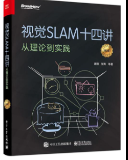

# 视觉SLAM 14讲 devcontainer 配置 docker 环境
<div style="text-align: center;">
	
</div>
高翔在2019年出版了《SLAM十四讲》一书，这本书是学习SLAM的经典入门书籍，书中提供了一些代码和数据，但是这些代码和数据是基于Ubuntu 18.04的。笔者曾在 22.04 和 20.04 测试过安装cereo和g2o库，均出现了不少了版本不必配的问题 （报错简直是满江红(ಠ╭╮ಠ)）。为了方便大家学习，我将这些代码的开发环境放到了一个基于 ubuntu18.04 的devcontainer中。

## 部署方法

1. 克隆环境配置代码并且使用vscode打开项目文件夹
```
git clone --recursive https://github.com/WeisonWEileen/slambook_devcontainer_docker.git
code slambook_devcontainer_docker
```

2. 在```.devcontainer.json```中，更改 ```USERNAME``` 选项更改成你的用户名

3. 打开vscode，按```ctrl + shift + P```，点击```Remote-Containers: Open Folder in Container```，选择克隆的文件夹，等待容器构建完成即可。进入slambook文件夹中即可正常编译代码运行

